Practice Data: https://github.com/Apollo-Level2-Web-Dev/mongodb-practice

Get ready to unlock the secrets of Mongoose, your key to mastering MongoDB in the Node.js world. This course will turn you into a data boss, teaching you how to add, search for, and change your information with ease.

Let's delve into the exciting journey that will make you a Mongoose master! Here's what you'll explore,

1) Install MongoDB compass & No SQL Booster ( windows, Mac & Linux): Before we dive in, we'll show you how to install the tools you need: MongoDB Compass & NoSQL Booster (think of them as fancy flashlights for your data). We'll have instructions for Windows, Mac, and Linux users.

2) insert, insertOne, find, findOne, field filtering, project: Dive into the fundamentals of inserting data into your MongoDB collections using insert and insertOne methods Master retrieving data. Explore the find method for retrieving multiple documents and findOne for fetching a single document. Learn how to filter specific fields from your retrieved documents using field filtering and projection techniques.

3) $eq, $neq, $gt, $lt, $gte, $lte: Unleash the power of comparison operators like $eq (equal to), $neq (not equal to), $gt (greater than), and more to pinpoint the exact data you need.

4) $in, $nin, implicit and condition: $in (included in) and $nin (not included in) operators for precise data selection. We'll also delve into implicit and conditional logic for crafting complex queries.

5) $and, $or, implicit vs explicit: learn how to combine multiple conditions using $and and $or operators to fine-tune your data retrieval. We'll cover both implicit and explicit ways to combine conditions for maximum flexibility.

6) $exists, $type,$size: Discover operators like $exists, $type, and $size for detailed data inspection.

7) $all , $elemMatch: Master array manipulation with operators like $all, $elemMatch. 

8) $set, $addToSet, $push: Explore operators like $set for updating existing field values, $addToSet for adding unique elements to an array, and $push for adding elements to an array regardless of uniqueness.

9) $unset, $pop, $pull, $pullAll: Learn how to remove specific fields using $unset, remove the last element from an array with $pop, and target specific elements for removal using $pull and $pullAll. 

10) More about $set: We'll also delve deeper into the nuances of $set for advanced usage scenarios.

11) Delete documents, drop collection and how to explore by yourself: Discover how to delete specific documents based on criteria. Learn how to completely remove a collection from your database. We'll equip you with strategies for effectively navigating the official Mongoose documentation to explore advanced features and functionalities on your own.

By diligently following this path and practicing the techniques you learn, you'll be well on your way to becoming a Mongoose Master and confidently managing your MongoDB data!

## 15-1-A Install MongoDB compass & No SQL Booster ( windows)
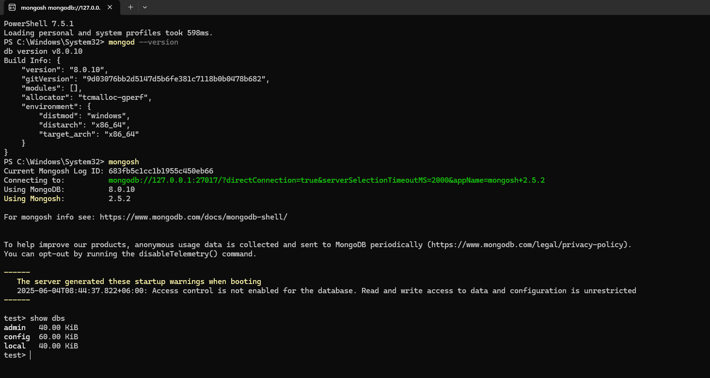
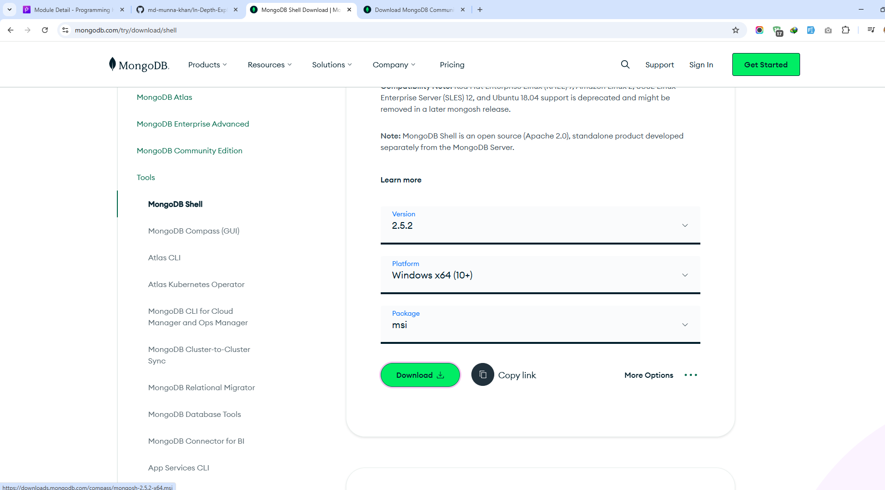
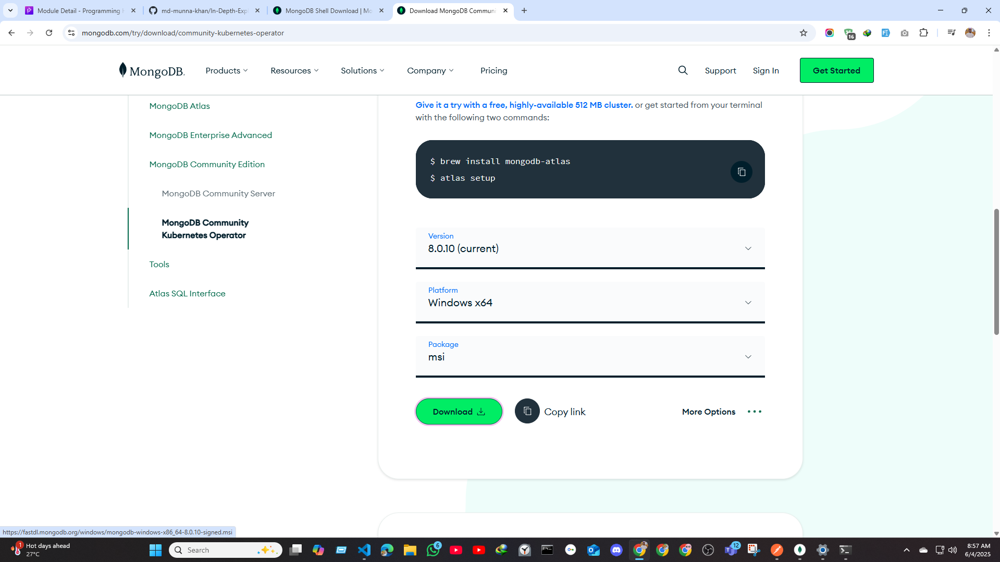
copy the path name
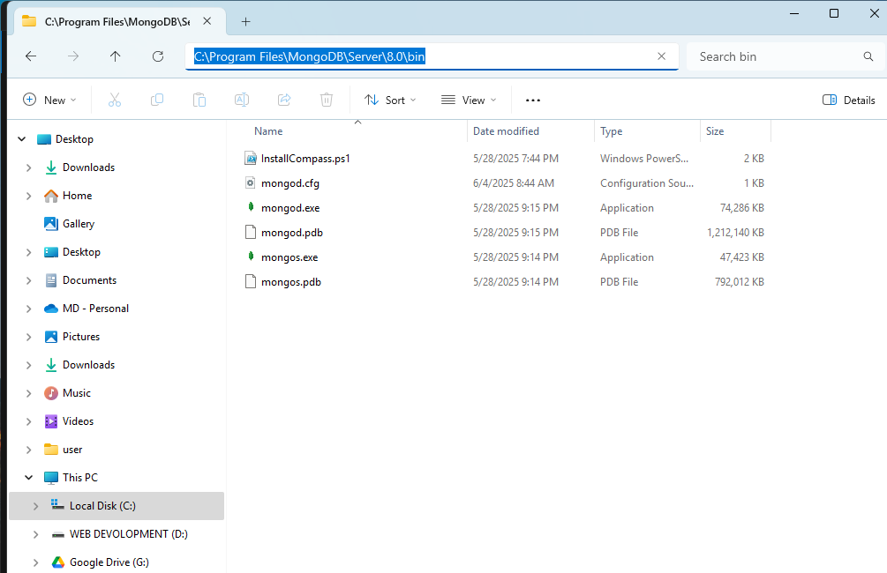
double click in path name and click and past the evn
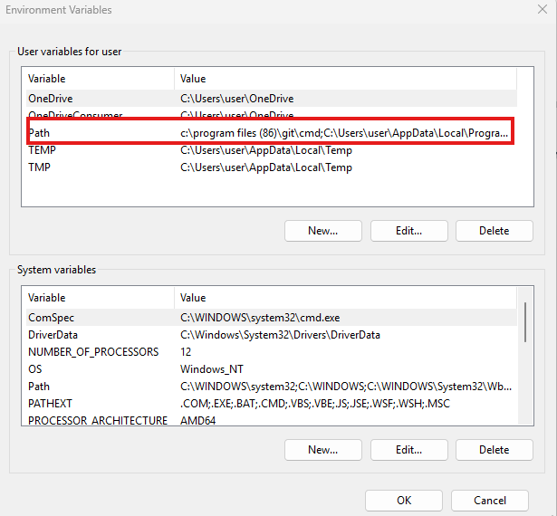

##  15-2 Insert,insertOne, find, findOne, field filtering, project
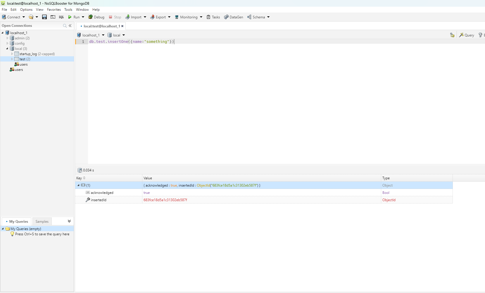
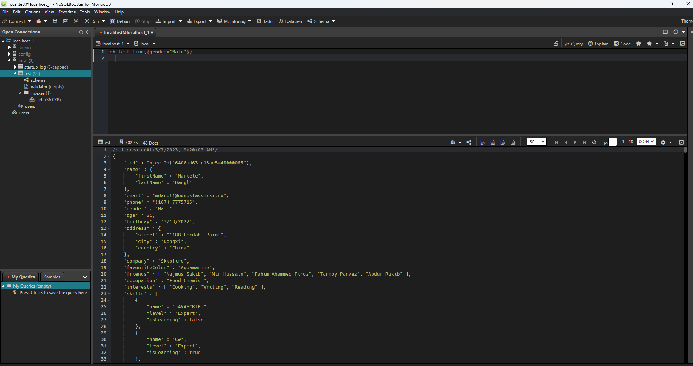
- 1 when you add one item use insertOne
- 2 when you add Many items use insertMany
- 3 when you find One  items use FindOne
- 4 when you find Many  items use Find
###### Fill Filtering
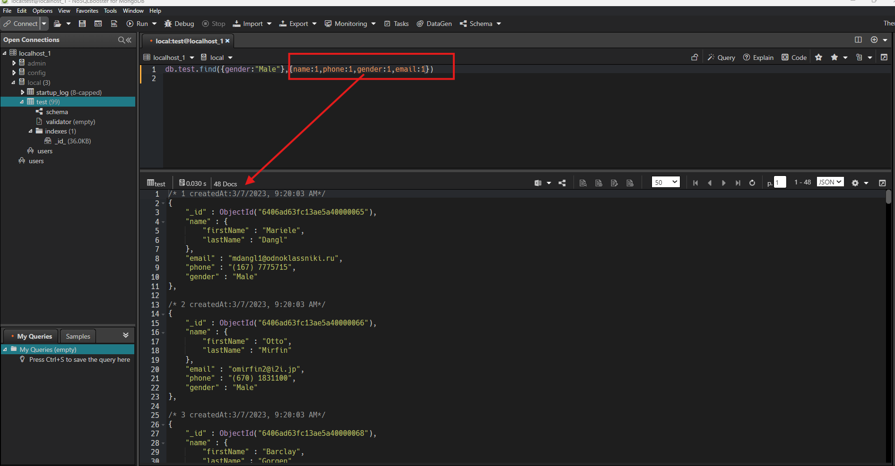
- 2nd Method use project()
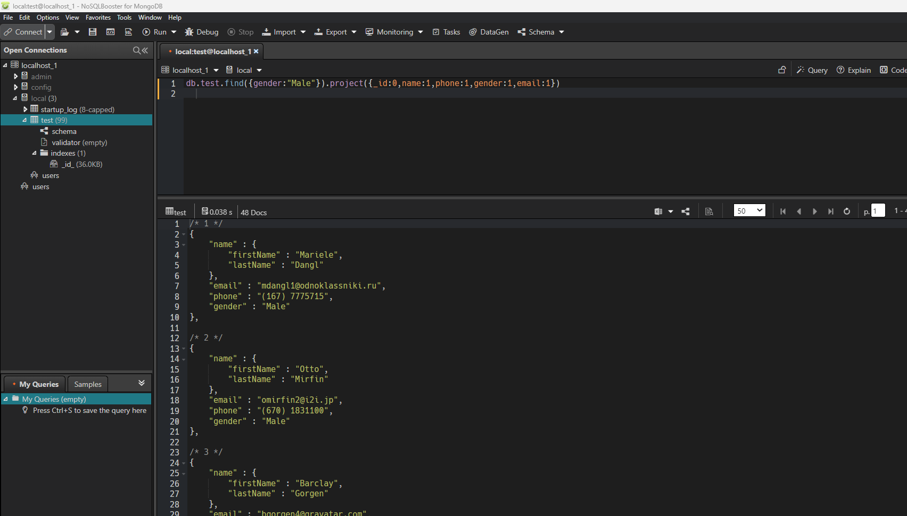

## 15-3 $eq, $neq, $gt, $lt, $gte, $lte
#####  equal =
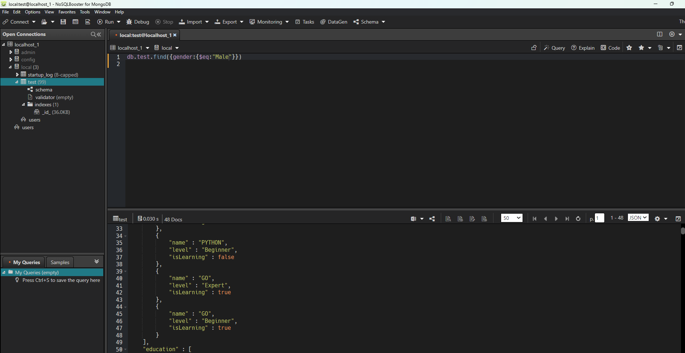
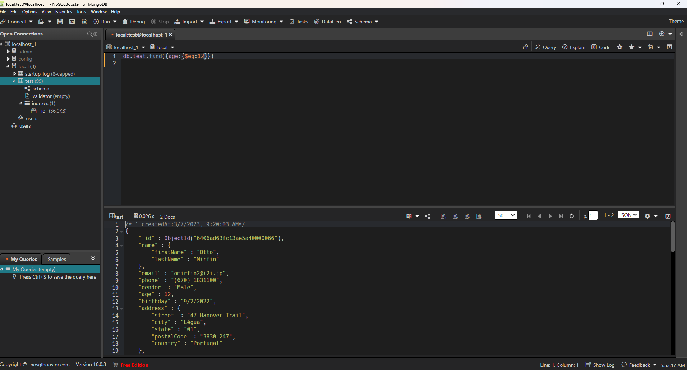
##### not equal
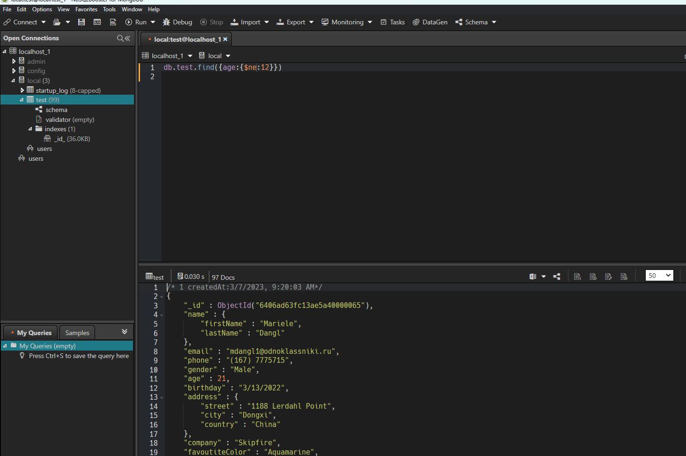
##### greater than
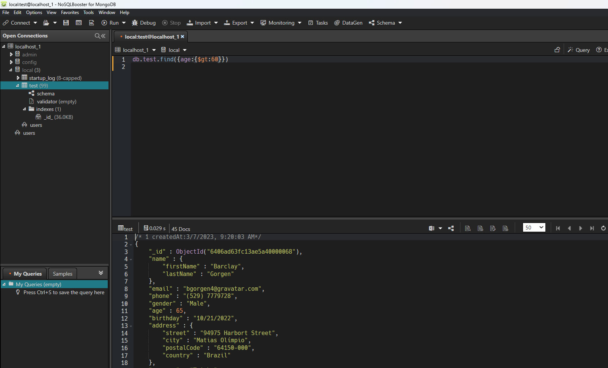
##### greater than equal = then i am sorting
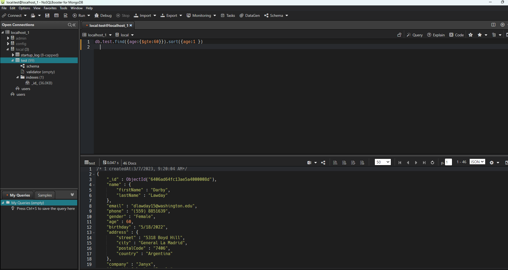
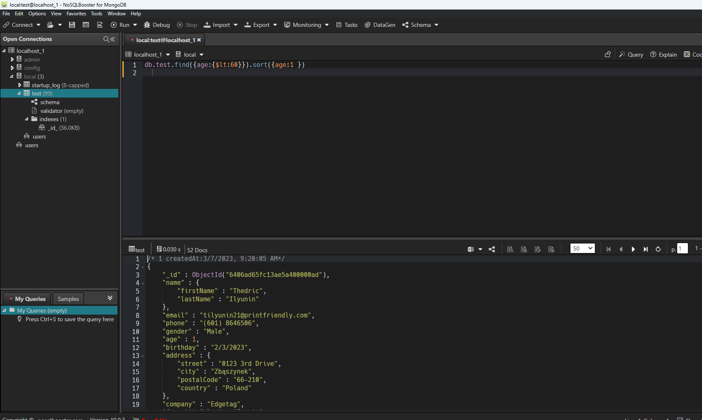